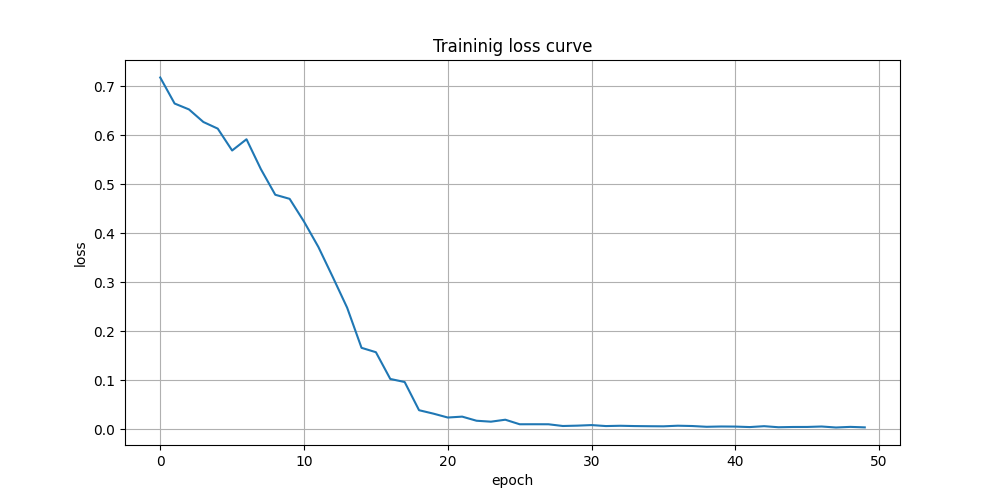

# Mini-Transformer for Text Classification

这是一个使用 PyTorch 实现的、用于文本分类任务的简化版 Transformer 模型。项目旨在清晰地展示 Transformer Encoder 的核心组件，包括词嵌入、位置编码、多头自注意力机制和前馈神经网络。

## 文本结构
```
mini_transformer/
├── transformer.py       # Transformer模型核心组件的实现
├── train.py             # 数据处理、模型训练和评估的主程序
├── config.json          # 存放所有超参数的配置文件
├── loss_curve.png       # 训练后生成的损失曲线图
└── README.md            # 本项目说明文件
```

## 模型结构

本模型主要由一个 Transformer Encoder 模块和一个分类头组成，其数据流如下：

1.  输入层 (Input Layer)
    - 词嵌入 (Token Embedding)：将输入的单词索引映射为 `d_model` 维度的密集向量。
    - 位置编码 (Positional Encoding)：为词向量注入序列的位置信息，使模型能够理解单词的顺序。

2.  Transformer Encoder 核心模块 (N层堆叠)
    对于每一层 Encoder Layer：
    - 多头自注意力层 (Multi-Head Self-Attention)：模型的核心，用于计算句子中每个单词与其他所有单词的关联度（注意力权重），从而捕捉上下文信息。
    - 残差连接与层归一化 (Add & Norm)：将注意力层的输出与其输入相加，然后进行层归一化，以稳定训练过程。
    - 前馈神经网络 (Feed-Forward Network)：对注意力层的输出进行非线性变换，增强模型的表达能力。
    - 残差连接与层归一化 (Add & Norm)：再次进行残差连接和归一化。

3.  输出层 (Output Layer)
    - 池化 (Pooling)：将 Encoder 最后一层输出的所有词向量进行平均池化，得到一个代表整句话的 `d_model` 维度的向量。
    - 线性分类头 (Linear Classifier)：一个简单的全连接层，将句子向量映射到最终的类别数（本项目中为2类：正面/负面），输出 logits。

## 训练结果截图

成功运行 `train.py` 后，会生成损失曲线图 `loss_curve.png`。
